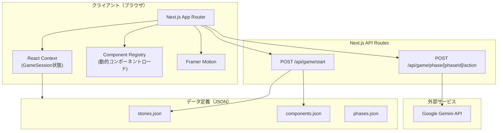

# アーキテクチャ

## システム構成図



## アーキテクチャ方針

### ストーリー＋コンポーネント構成

ゲームは「ストーリー（攻撃テーマ）」を軸に進行する。各ストーリーは4つのフェーズで構成され、フェーズごとにコンポーネント（攻撃手法ミニゲーム）がランダムに選ばれる。コンポーネントは単体でも練習可能。

### フロントエンド中心のシンプル構成

MVP段階ではデータベースを持たず、ゲームの状態はすべてクライアントサイド（React Context）で管理する。ストーリーとコンポーネントの定義は `src/data/` のJSONファイルで管理する。Gemini API の呼び出しのみ、Next.js API Routes を経由してサーバーサイドで行う（APIキーの秘匿のため）。

### ディレクトリ構成

```
src/
├── app/
│   ├── layout.tsx                    # ルートレイアウト（サイバーパンクテーマ）
│   ├── page.tsx                      # トップ画面（ストーリー選択）
│   ├── story/
│   │   └── [storyId]/
│   │       ├── page.tsx              # ストーリー詳細・ゲーム開始画面
│   │       └── play/
│   │           └── page.tsx          # ゲーム進行画面（フェーズ遷移）
│   ├── component/
│   │   └── [componentId]/
│   │       └── page.tsx              # 個別コンポーネント練習モード
│   ├── result/
│   │   └── page.tsx                  # セッション結果画面（全フェーズ統合）
│   └── api/
│       └── game/
│           ├── start/route.ts        # セッション開始（コンポーネント決定・コンテキスト生成）
│           └── phase/
│               └── [phaseId]/
│                   └── action/route.ts # フェーズ内アクション（Gemini API呼び出し含む）
├── components/
│   ├── story/
│   │   ├── StoryCard.tsx             # ストーリー選択カード
│   │   ├── StoryDetail.tsx           # ストーリー詳細表示
│   │   └── PhaseTimeline.tsx         # フェーズ進行タイムライン
│   ├── game/
│   │   ├── GameContainer.tsx         # ゲーム全体の状態管理・フェーズ遷移
│   │   ├── PhaseTransition.tsx       # フェーズ間遷移演出
│   │   └── components/              # 各攻撃コンポーネントのUI
│   │       ├── ShoulderHacking.tsx
│   │       ├── PasswordCracking.tsx
│   │       ├── Phishing.tsx
│   │       ├── NetworkIntrusion.tsx
│   │       ├── Ransomware.tsx
│   │       └── index.ts             # コンポーネントレジストリ
│   ├── result/
│   │   ├── SessionReport.tsx         # セッション全体のレポート
│   │   ├── PhaseScoreCard.tsx        # 各フェーズのスコア表示
│   │   ├── RankBadge.tsx             # ランク表示
│   │   └── AIFeedback.tsx            # AIフィードバック表示
│   └── ui/
│       ├── CyberButton.tsx           # サイバーパンク風ボタン
│       ├── GlowCard.tsx              # グロー効果付きカード
│       ├── TerminalText.tsx          # ターミナル風テキスト表示
│       └── NeonBadge.tsx             # ネオンバッジ
├── data/
│   ├── stories.json                  # ストーリー定義
│   ├── components.json               # コンポーネント定義
│   └── phases.json                   # フェーズ定義
├── lib/
│   ├── gemini.ts                     # Gemini API クライアント
│   ├── prompts/
│   │   ├── common.ts                 # 共通プロンプト（ストーリーコンテキスト注入）
│   │   ├── shoulder-hacking.ts       # ショルダーハッキング用プロンプト
│   │   ├── password-cracking.ts      # パスワードクラッキング用プロンプト
│   │   ├── phishing.ts              # フィッシング用プロンプト
│   │   ├── network-intrusion.ts     # ネットワーク侵入用プロンプト
│   │   └── ransomware.ts            # ランサムウェア用プロンプト
│   ├── scoring.ts                    # スコアリングロジック
│   ├── session.ts                    # セッション管理（クライアントサイド）
│   └── component-registry.ts         # コンポーネント→UI/ロジック対応表
├── contexts/
│   └── GameContext.tsx                # ゲーム状態管理
├── types/
│   └── index.ts                      # 型定義
└── styles/
    └── globals.css                   # グローバルスタイル（サイバーパンクテーマ）
```

## 技術的な判断

### Gemini API 呼び出しはサーバーサイドで行う
- APIキーをクライアントに露出させないため、Next.js API Routes 経由で呼び出す
- 各フェーズのアクション API（`/api/game/phase/[phaseId]/action`）内で Gemini API を呼び出す
- プロンプトの組み立てもサーバーサイドで行い、ストーリーコンテキストを注入する

### 状態管理は React Context で行う
- MVP段階でDB不要のため、ゲーム進行状態は Context API で管理
- GameSession（セッション情報、フェーズ結果、コンテキスト引き継ぎ情報）を保持
- ブラウザリロードでリセットされる（MVPでは許容）

### ストーリー＋コンポーネントのデータ駆動
- ストーリーとコンポーネントの定義は `src/data/` のJSONファイルで管理
- ストーリーごとにフェーズ別のコンポーネントプールを定義し、プレイ時にランダム選択
- コンポーネントレジストリ（`component-registry.ts`）でコンポーネントIDとUIの対応を管理
- 将来のDB化に備え、JSONの構造をテーブル設計に準拠させる

### フェーズ間のコンテキスト引き継ぎ
- 各フェーズの結果に `contextOutput` を含め、次フェーズへの入力とする
- 例: フェーズ1で発見した情報 → フェーズ2のフィッシングターゲット
- ストーリーコンテキスト（業界・ターゲット企業情報）は全フェーズで共有

### Framer Motion でアニメーションを統一
- ページ遷移: `AnimatePresence` でスムーズな画面切り替え
- フェーズ遷移: サイバーパンク風の演出（グリッチエフェクト等）
- UI要素: カードのホバー・タップアニメーション
- ゲーム演出: ターミナル文字表示、暗号化アニメーション、スコア表示演出
- パフォーマンス: `layout` アニメーションと `will-change` で最適化

### Gemini APIのプロンプト設計方針
- 各コンポーネント専用のシステムプロンプトを `lib/prompts/` に定義
- `common.ts` でストーリーコンテキスト（業界・ターゲット情報）をプロンプトに注入
- レスポンスは構造化JSON形式で返すよう指示（パース容易性のため）
- ストリーミングレスポンスは結果画面のフィードバック表示時に活用

## 非機能要件

### パフォーマンス
- Gemini API呼び出し中はローディングアニメーション表示
- 初回ロード時にストーリー・コンポーネントメタデータをプリフェッチ

### セキュリティ
- Gemini API キーは環境変数で管理（`GEMINI_API_KEY`）
- API Route でレート制限を簡易実装（MVP）

### レスポンシブ
- モバイルファースト設計（UIモックアップがモバイル基準）
- PC表示時は max-width で中央寄せ
