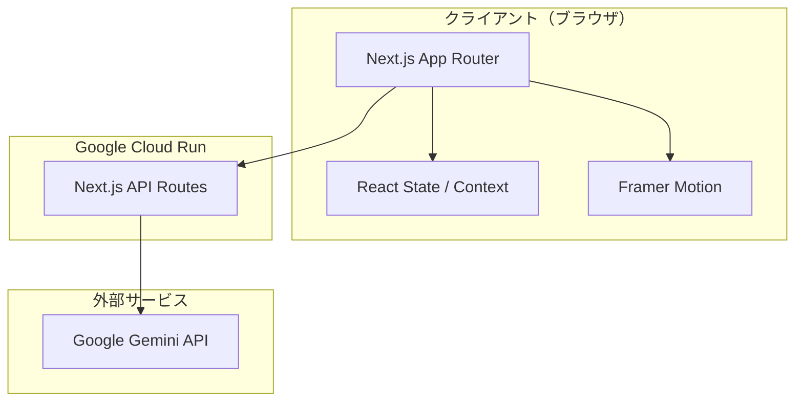

# アーキテクチャ

## システム構成図



## アーキテクチャ方針

### フロントエンド中心のシンプル構成

MVP段階ではデータベースを持たず、ゲームの状態はすべてクライアントサイド（React State / Context）で管理する。Gemini API の呼び出しのみ、Next.js API Routes を経由してサーバーサイドで行う（APIキーの秘匿のため）。

### ディレクトリ構成

```
src/
├── app/
│   ├── layout.tsx              # ルートレイアウト（サイバーパンクテーマ）
│   ├── page.tsx                # ハブ画面（ステージ選択）
│   ├── stage/
│   │   ├── [stageId]/
│   │   │   └── page.tsx        # 各ステージのゲーム画面
│   │   └── result/
│   │       └── page.tsx        # 結果画面
│   └── api/
│       └── gemini/
│           └── route.ts        # Gemini API プロキシ
├── components/
│   ├── hub/
│   │   ├── StageCard.tsx       # ステージカード
│   │   ├── OperationCard.tsx   # OPERATIONフィーチャーカード
│   │   ├── TabNav.tsx          # タブナビゲーション
│   │   ├── CharacterTab.tsx    # キャラタブ
│   │   └── DemoTab.tsx         # 体験デモタブ
│   ├── stages/
│   │   ├── shoulder-hacking/
│   │   │   ├── ShoulderHackingGame.tsx
│   │   │   └── SceneDisplay.tsx
│   │   ├── password-cracking/
│   │   │   ├── PasswordCrackingGame.tsx
│   │   │   ├── TerminalUI.tsx
│   │   │   └── ProfileCard.tsx
│   │   ├── phishing/
│   │   │   ├── PhishingGame.tsx
│   │   │   ├── EmailComposer.tsx
│   │   │   └── TargetBriefing.tsx
│   │   └── ransomware/
│   │       ├── RansomwareGame.tsx
│   │       ├── PhaseNavigator.tsx
│   │       └── EncryptionAnimation.tsx
│   ├── result/
│   │   ├── ScoreDisplay.tsx    # スコア円形プログレス
│   │   ├── RankBadge.tsx       # ランク表示
│   │   └── AIFeedback.tsx      # AIフィードバック表示
│   └── ui/
│       ├── CyberButton.tsx     # サイバーパンク風ボタン
│       ├── GlowCard.tsx        # グロー効果付きカード
│       ├── TerminalText.tsx    # ターミナル風テキスト表示
│       └── NeonBadge.tsx       # ネオンバッジ
├── lib/
│   ├── gemini.ts               # Gemini API クライアント
│   ├── prompts/
│   │   ├── shoulder-hacking.ts # Stage 1 用プロンプト
│   │   ├── password-cracking.ts# Stage 2 用プロンプト
│   │   ├── phishing.ts         # Stage 3 用プロンプト
│   │   └── ransomware.ts       # Stage 4 用プロンプト
│   ├── scoring.ts              # スコアリングロジック
│   └── stages.ts               # ステージ定義・メタデータ
├── contexts/
│   └── GameContext.tsx          # ゲーム状態管理
├── types/
│   └── index.ts                # 型定義
└── styles/
    └── globals.css             # グローバルスタイル（サイバーパンクテーマ）
```

## 技術的な判断

### Gemini API 呼び出しはサーバーサイドで行う
- APIキーをクライアントに露出させないため、Next.js API Routes 経由で呼び出す
- API Route はシンプルなプロキシとして機能し、プロンプトの組み立てもサーバーサイドで行う

### 状態管理は React Context で行う
- MVP段階でDB不要のため、ゲーム進行状態は Context API で管理
- 各ステージのスコア、進行状況、Gemini APIのレスポンスキャッシュを保持
- ブラウザリロードでリセットされる（MVPでは許容）

### Framer Motion でアニメーションを統一
- ページ遷移: `AnimatePresence` でスムーズな画面切り替え
- UI要素: カードのホバー・タップアニメーション
- ゲーム演出: ターミナル文字表示、暗号化アニメーション、スコア表示演出
- パフォーマンス: `layout` アニメーションと `will-change` で最適化

### Gemini APIのプロンプト設計方針
- 各ステージ専用のシステムプロンプトを `lib/prompts/` に定義
- レスポンスは構造化JSON形式で返すよう指示（パース容易性のため）
- ストリーミングレスポンスは結果画面のフィードバック表示時に活用

## 非機能要件

### パフォーマンス
- Gemini API呼び出し中はローディングアニメーション表示
- 初回ロード時にステージメタデータをプリフェッチ

### セキュリティ
- Gemini API キーは環境変数で管理（`GEMINI_API_KEY`）
- API Route でレート制限を簡易実装（MVP）

### レスポンシブ
- モバイルファースト設計（UIモックアップがモバイル基準）
- PC表示時は max-width で中央寄せ
