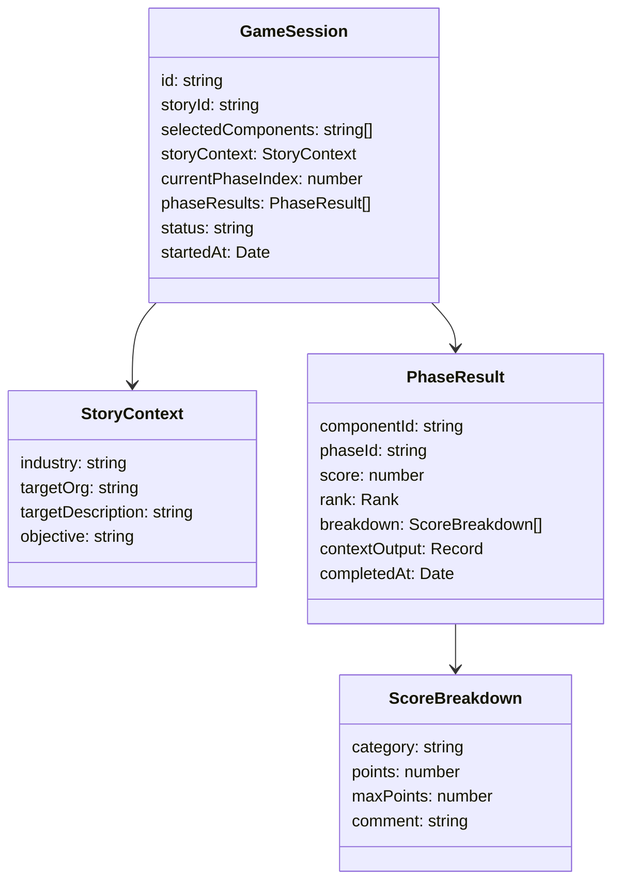
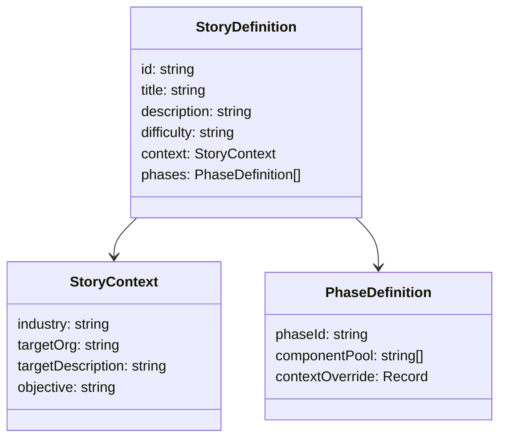
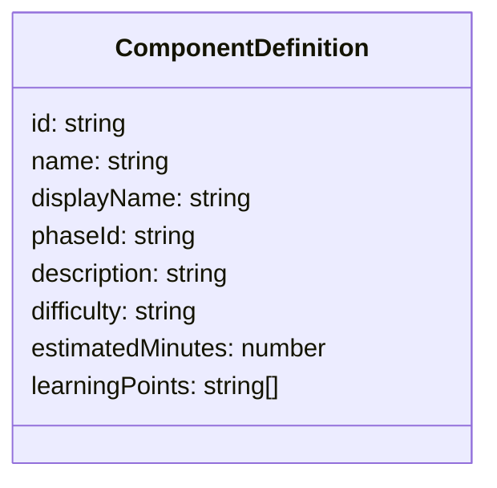
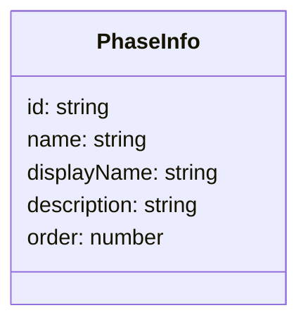
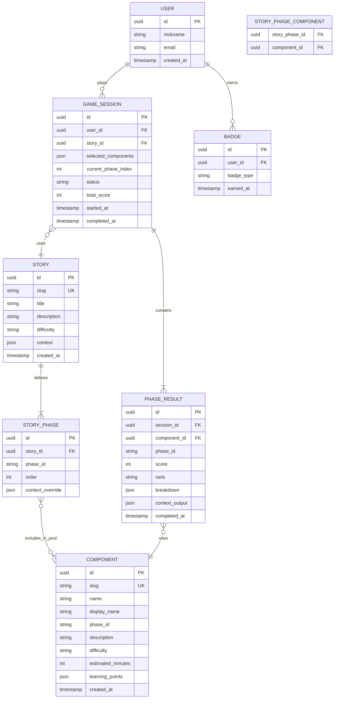

# データモデル

## 概要

MVP段階ではデータベースを使用しない。ストーリーとコンポーネントの定義は `src/data/` のJSONファイルで管理し、ゲームの進行状態はクライアントサイドの React Context で管理する。以下は現在のクライアントサイドの型定義と、将来のDB導入時に参考となるデータモデルである。

## クライアントサイドの状態構造



## データ定義（JSONファイル）

### stories.json



### components.json



### phases.json



## 型定義（TypeScript）

```typescript
// フェーズID
type PhaseId = 'recon' | 'credential' | 'intrusion' | 'objective';

// ランク
type Rank = 'S' | 'A' | 'B' | 'C' | 'D';

// 難易度
type Difficulty = 'easy' | 'normal' | 'hard';

// ストーリー定義
interface StoryDefinition {
  id: string;
  title: string;
  description: string;
  difficulty: Difficulty;
  context: StoryContext;
  phases: PhaseDefinition[];
}

interface StoryContext {
  industry: string;
  targetOrg: string;
  targetDescription: string;
  objective: string;
}

interface PhaseDefinition {
  phaseId: PhaseId;
  componentPool: string[];
  contextOverride?: Record<string, unknown>;
}

// コンポーネント定義
interface ComponentDefinition {
  id: string;
  name: string;
  displayName: string;
  phaseId: PhaseId;
  description: string;
  difficulty: Difficulty;
  estimatedMinutes: number;
  learningPoints: string[];
}

// セッション状態
interface GameSession {
  id: string;
  storyId: string;
  selectedComponents: string[];
  storyContext: StoryContext;
  currentPhaseIndex: number;
  phaseResults: PhaseResult[];
  status: 'in_progress' | 'completed';
  startedAt: Date;
}

interface PhaseResult {
  componentId: string;
  phaseId: PhaseId;
  score: number;
  rank: Rank;
  breakdown: ScoreBreakdown[];
  contextOutput: Record<string, unknown>;
  completedAt: Date;
}

interface ScoreBreakdown {
  category: string;
  points: number;
  maxPoints: number;
  comment: string;
}
```

## 将来のDB導入時のER図


