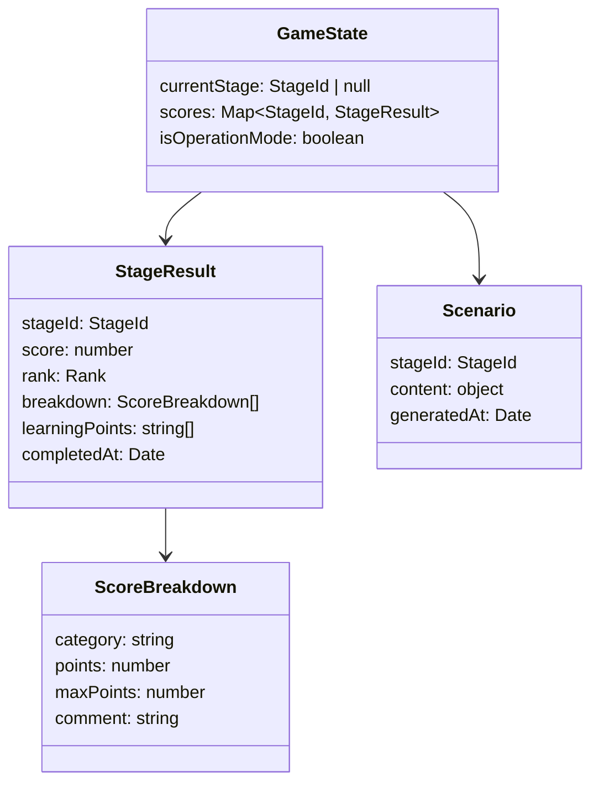
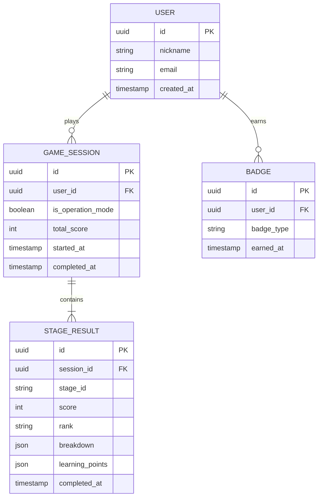

# データモデル

## 概要

MVP段階ではデータベースを使用しない。すべてのデータはクライアントサイドの React Context / State で管理する。以下は将来のDB導入時に参考となるデータモデルの概要と、現在のクライアントサイドの型定義である。

## クライアントサイドの状態構造



## 型定義（TypeScript）

```typescript
type StageId = 'shoulder-hacking' | 'password-cracking' | 'phishing' | 'ransomware';
type Rank = 'S' | 'A' | 'B' | 'C' | 'D';
type Difficulty = 'easy' | 'normal' | 'hard';

interface StageResult {
  stageId: StageId;
  score: number;        // 0-100
  rank: Rank;
  breakdown: ScoreBreakdown[];
  learningPoints: string[];
  completedAt: Date;
}

interface ScoreBreakdown {
  category: string;
  points: number;
  maxPoints: number;
  comment: string;
}
```

## 将来のDB導入時のER図


