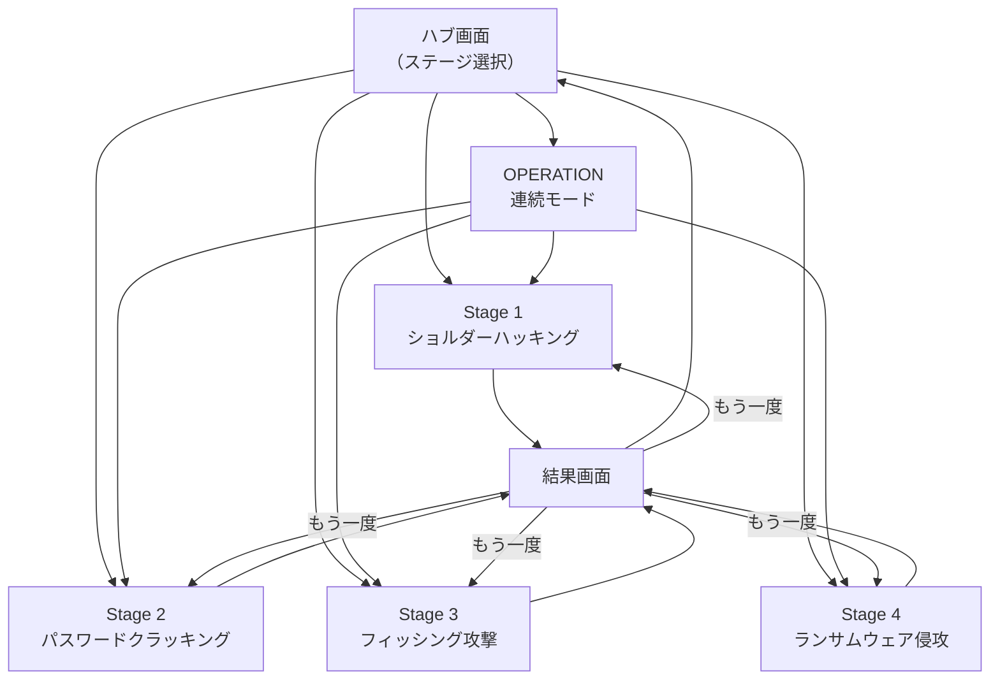

# 画面一覧

## 画面遷移図

## 画面一覧

| 画面名 | パス | 説明 |
|--------|------|------|
| ハブ画面 | `/` | ステージ選択・キャラ・体験デモのタブ切り替え |
| ショルダーハッキング | `/stage/shoulder-hacking` | Stage 1 ゲーム画面 |
| パスワードクラッキング | `/stage/password-cracking` | Stage 2 ゲーム画面 |
| フィッシング攻撃 | `/stage/phishing` | Stage 3 ゲーム画面 |
| ランサムウェア侵攻 | `/stage/ransomware` | Stage 4 ゲーム画面 |
| 結果画面 | `/stage/[stageId]/result` | スコア・ランク・AIフィードバック |

## 画面詳細

### ハブ画面（`/`）

#### ヘッダー
- ロゴ: 🛡️ CyberGuardians（シールドアイコン＋タイトル）
- サブタイトル: 「攻撃者の目線で学ぶ、サイバーセキュリティ体験学習」

#### タブナビゲーション
- ⚔️ ステージ（デフォルト選択）
- 👥 キャラ
- 🖥️ 体験デモ

#### ステージタブ内容
- **OPERATIONカード**: 紫グラデーション枠、⚔️アイコン、「OPERATION: RANSOMWARE」タイトル、「攻撃チェーンを体験する4フェーズゲーム」説明、「プレイする →」ピンクグラデーションボタン
- **ATTACK SIDEセクションヘッダー**: 「ATTACK SIDE — 攻撃者体験」＋「シャドウを操作して企業への侵入を試みよ」
- **ステージカード一覧**（各カード）: アイコン、ステージ番号＋名前、説明テキスト、難易度ドット（右側）

#### 難易度ドットの色
| ステージ | 難易度 | ドット表示 |
|----------|--------|------------|
| Stage 1 | ★☆☆ | 🟡⚫⚫ |
| Stage 2 | ★★☆ | 🔴🔴⚫ |
| Stage 3 | ★★☆ | 🟣🟣⚫ |
| Stage 4 | ★★★ | 🔴🔴🔴 |

### 各ステージ共通レイアウト
- ヘッダー: ステージ名＋戻るボタン
- メインエリア: ゲーム固有のUI
- フッター: スコア表示・進行状況

### 結果画面（`/stage/[stageId]/result`）
- スコア: 円形プログレスバー（0〜100、アニメーション付き）
- ランク: S/A/B/C/D のバッジ（Framer Motionでバウンス表示）
- AIフィードバック: Gemini APIからのストリーミング表示（タイプライターエフェクト）
- 学習ポイント: カード形式で3〜5項目
- アクション: 「もう一度プレイ」「ステージ選択に戻る」ボタン

## デザインシステム

### カラーパレット（サイバーパンク）
| 用途 | カラー |
|------|--------|
| 背景（メイン） | `#0a0a1a`（ダークネイビー） |
| 背景（カード） | `#1a1a2e`（ダークパープル） |
| テキスト（メイン） | `#e0e0e0`（ライトグレー） |
| テキスト（サブ） | `#8888aa`（ミュートパープル） |
| アクセント（プライマリ） | `#00ff88`（ネオングリーン） |
| アクセント（セカンダリ） | `#ff00ff`〜`#ff6b9d`（ピンク〜マゼンタグラデーション） |
| アクセント（警告） | `#ff4444`（レッド） |
| アクセント（情報） | `#6666ff`（パープル） |
| ボーダー/グロー | `rgba(100, 100, 255, 0.3)`（パープルグロー） |

### フォント
- 日本語: Noto Sans JP
- 英語/コード: JetBrains Mono（ターミナル風）

### アニメーション方針
- ページ遷移: フェードイン + スライドアップ (0.3s)
- カードホバー: スケール 1.02 + グロー強化
- カードタップ: スケール 0.98 (0.1s)
- スコア: 円形プログレスが0からスコアまでアニメーション (1.5s)
- ランク表示: 遅延表示 + バウンスエフェクト
- ターミナルテキスト: 1文字ずつ表示（タイプライター）
