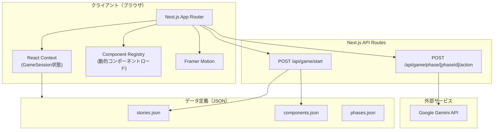

# ストーリー＋コンポーネント アーキテクチャ設計

## 概要

ゲームの進行方式を「固定4ステージ」から「ストーリー（テーマ）選択 → コンポーネント（攻撃手法）自動組み合わせ」に変更する。これにより、同じテーマでも毎回異なるコンポーネント構成でプレイでき、リプレイ性と教育効果を高める。

## 設計思想

- **ストーリー（Story）**: プレイヤーが選ぶ攻撃テーマ。業界・ターゲット・最終目的を定義
- **コンポーネント（Component）**: 各フェーズで使える個別の攻撃手法ミニゲーム。独立して動作可能
- **フェーズ（Phase）**: 攻撃チェーンの段階。固定4段階
- **コンテキスト共有**: ストーリーがコンテキスト情報を全フェーズに提供し、一貫した体験を保証

---

## 用語定義

| 用語 | 英語 | 説明 | 例 |
|------|------|------|-----|
| ストーリー | Story | プレイヤーが選ぶ攻撃テーマ | 「病院の患者情報を盗め」 |
| フェーズ | Phase | 攻撃チェーンの段階（固定4段階） | Phase 1: 情報収集 |
| コンポーネント | Component | 各フェーズで使える個別の攻撃手法ミニゲーム | ショルダーハッキング |
| セッション | Session | 1回のプレイスルー全体 | ストーリー + 選ばれたコンポーネント群 |

---

## フェーズ定義

| ID | 名称 | 英語表示 | 目的 |
|----|------|---------|------|
| `recon` | 情報収集 | RECONNAISSANCE | ターゲットの情報を集める |
| `credential` | 認証窃取 | CREDENTIAL THEFT | ID/パスワード等を手に入れる |
| `intrusion` | 侵入 | INTRUSION | システムに侵入・権限昇格 |
| `objective` | 目的達成 | OBJECTIVE | 最終目的を遂行（暗号化・窃取等） |

---

## コンポーネントのフェーズ割り当て

| コンポーネント | ID | フェーズ | 旧ステージ |
|--------------|-----|---------|----------|
| ショルダーハッキング | `shoulder-hacking` | recon | Stage 1 |
| パスワードクラッキング | `password-cracking` | credential | Stage 2 |
| フィッシング | `phishing` | credential | Stage 3 |
| ネットワーク侵入 | `network-intrusion` | intrusion | Stage 4の一部 |
| ランサムウェア展開 | `ransomware` | objective | Stage 4の一部 |

将来追加例: ダンプスターダイビング(recon)、ソーシャルエンジニアリング(recon)、SQLインジェクション(intrusion)、データ窃取(objective) など

---

## データモデル

### ストーリー定義

```typescript
interface StoryDefinition {
  id: string;                    // "hospital-data-theft"
  title: string;                 // "OPERATION: HOSPITAL BREACH"
  description: string;           // "病院の患者情報を盗み出せ"
  difficulty: 'easy' | 'normal' | 'hard';
  context: StoryContext;
  phases: PhaseDefinition[];
}

interface StoryContext {
  industry: string;              // "医療"
  targetOrg: string;             // "〇〇総合病院"
  targetDescription: string;     // "地方の中規模総合病院。電子カルテを導入済み"
  objective: string;             // "患者の個人情報を暗号化し身代金を要求"
}

interface PhaseDefinition {
  phaseId: 'recon' | 'credential' | 'intrusion' | 'objective';
  componentPool: string[];       // ["shoulder-hacking", "dumpster-diving"]
  contextOverride?: Record<string, unknown>; // フェーズ固有の補足情報
}
```

### コンポーネント定義

```typescript
interface ComponentDefinition {
  id: string;                    // "shoulder-hacking"
  name: string;                  // "ショルダーハッキング"
  displayName: string;           // "SHOULDER HACKING"
  phaseId: string;               // "recon"
  description: string;
  difficulty: 'easy' | 'normal' | 'hard';
  estimatedMinutes: number;
  learningPoints: string[];
}
```

### セッション状態

```typescript
interface GameSession {
  id: string;
  storyId: string;
  selectedComponents: string[];  // フェーズ順にコンポーネントIDの配列
  storyContext: StoryContext;
  currentPhaseIndex: number;     // 0-3
  phaseResults: PhaseResult[];
  status: 'in_progress' | 'completed';
  startedAt: Date;
}

interface PhaseResult {
  componentId: string;
  phaseId: string;
  score: number;
  rank: Rank;
  breakdown: ScoreBreakdown[];
  contextOutput: Record<string, unknown>; // 次フェーズに引き継ぐ情報
  completedAt: Date;
}

type Rank = 'S' | 'A' | 'B' | 'C' | 'D';

interface ScoreBreakdown {
  category: string;
  points: number;
  maxPoints: number;
  comment: string;
}
```

### フェーズ間のコンテキスト引き継ぎ

`PhaseResult.contextOutput` により、前のフェーズの成果を次のフェーズに渡す。

例: Phase 1（情報収集）で「メールアドレスを発見」→ `{ discoveredEmail: "tanaka@hospital.jp" }` → Phase 2（フィッシング）のターゲットとして使用

---

## サンプルストーリー定義

```json
{
  "id": "hospital-data-theft",
  "title": "OPERATION: HOSPITAL BREACH",
  "description": "病院の患者情報を盗み出せ",
  "difficulty": "normal",
  "context": {
    "industry": "医療",
    "targetOrg": "さくら総合病院",
    "targetDescription": "地方の中規模総合病院。電子カルテシステムを導入して3年。ITスタッフは2名。",
    "objective": "患者の個人情報データベースを暗号化し身代金を要求する"
  },
  "phases": [
    {
      "phaseId": "recon",
      "componentPool": ["shoulder-hacking", "dumpster-diving"],
      "contextOverride": { "location": "病院の待合室" }
    },
    {
      "phaseId": "credential",
      "componentPool": ["phishing", "password-cracking"]
    },
    {
      "phaseId": "intrusion",
      "componentPool": ["network-intrusion"]
    },
    {
      "phaseId": "objective",
      "componentPool": ["ransomware", "data-exfiltration"]
    }
  ]
}
```

---

## ディレクトリ構成

```
src/
├── app/
│   ├── layout.tsx                    # ルートレイアウト（サイバーパンクテーマ）
│   ├── page.tsx                      # トップ画面（ストーリー選択）
│   ├── story/
│   │   └── [storyId]/
│   │       ├── page.tsx              # ストーリー詳細・ゲーム開始画面
│   │       └── play/
│   │           └── page.tsx          # ゲーム進行画面（フェーズ遷移）
│   ├── component/
│   │   └── [componentId]/
│   │       └── page.tsx              # 個別コンポーネント練習モード
│   ├── result/
│   │   └── page.tsx                  # セッション結果画面（全フェーズ統合）
│   └── api/
│       └── game/
│           ├── start/route.ts        # セッション開始（コンポーネント決定・コンテキスト生成）
│           └── phase/
│               └── [phaseId]/
│                   └── action/route.ts # フェーズ内アクション（Gemini API呼び出し含む）
├── components/
│   ├── story/
│   │   ├── StoryCard.tsx             # ストーリー選択カード
│   │   ├── StoryDetail.tsx           # ストーリー詳細表示
│   │   └── PhaseTimeline.tsx         # フェーズ進行タイムライン
│   ├── game/
│   │   ├── GameContainer.tsx         # ゲーム全体の状態管理・フェーズ遷移
│   │   ├── PhaseTransition.tsx       # フェーズ間遷移演出
│   │   └── components/              # 各攻撃コンポーネントのUI
│   │       ├── ShoulderHacking.tsx
│   │       ├── PasswordCracking.tsx
│   │       ├── Phishing.tsx
│   │       ├── NetworkIntrusion.tsx
│   │       ├── Ransomware.tsx
│   │       └── index.ts             # コンポーネントレジストリ
│   ├── result/
│   │   ├── SessionReport.tsx         # セッション全体のレポート
│   │   ├── PhaseScoreCard.tsx        # 各フェーズのスコア表示
│   │   ├── RankBadge.tsx
│   │   └── AIFeedback.tsx
│   └── ui/
│       ├── CyberButton.tsx
│       ├── GlowCard.tsx
│       ├── TerminalText.tsx
│       └── NeonBadge.tsx
├── data/
│   ├── stories.json                  # ストーリー定義
│   ├── components.json               # コンポーネント定義
│   └── phases.json                   # フェーズ定義
├── lib/
│   ├── gemini.ts                     # Gemini API クライアント
│   ├── prompts/
│   │   ├── common.ts                 # 共通プロンプト（ストーリーコンテキスト注入）
│   │   ├── shoulder-hacking.ts
│   │   ├── password-cracking.ts
│   │   ├── phishing.ts
│   │   ├── network-intrusion.ts
│   │   └── ransomware.ts
│   ├── scoring.ts                    # スコアリングロジック
│   ├── session.ts                    # セッション管理（クライアントサイド）
│   └── component-registry.ts         # コンポーネント→UI/ロジック対応表
├── contexts/
│   └── GameContext.tsx                # ゲーム状態管理
├── types/
│   └── index.ts                      # 型定義
└── styles/
    └── globals.css
```

---

## システム構成図



---

## 画面遷移

```
トップ画面（ストーリー選択）
  │
  ├── [ストーリーカード選択]
  │   └── ストーリー詳細画面
  │       ├── ストーリー概要・ターゲット情報
  │       ├── 今回のコンポーネント構成（ランダム決定済み）表示
  │       └── [START] → ゲーム進行画面
  │           ├── Phase 1 コンポーネント
  │           ├── [フェーズ遷移演出]
  │           ├── Phase 2 コンポーネント
  │           ├── [フェーズ遷移演出]
  │           ├── Phase 3 コンポーネント
  │           ├── [フェーズ遷移演出]
  │           ├── Phase 4 コンポーネント
  │           └── → セッション結果画面
  │
  └── [コンポーネント単体選択]（練習モード）
      └── 個別コンポーネント画面
          └── → コンポーネント結果画面
```

---

## 旧設計からの変更点

| 項目 | 旧 | 新 |
|------|-----|-----|
| ゲーム単位 | Stage（固定4つ） | Story → Phase → Component |
| 選択画面 | ステージ選択（タブ付きハブ） | ストーリー選択 + 練習モード |
| 進行 | 各ステージ独立 | ストーリー内4フェーズ連鎖 |
| シナリオ | ステージごとに完結 | ストーリーコンテキストで一貫 |
| OPERATIONモード | Stage 1-4を順番に | ストーリーそのもの（廃止統合） |
| データ保存 | なし（Context） | JSON定義 + Context |
| URL構造 | `/stage/[stageId]` | `/story/[storyId]/play` + `/component/[id]` |
| API | geminiプロキシ + sessionId API | start + phase action のみ |

---

## 将来のDB化パス

現在の JSON 定義は以下のテーブルにマッピング可能:

| JSON | テーブル |
|------|---------|
| stories.json | `stories` + `story_phases` |
| components.json | `components` |
| phases.json | `phases` |
| GameSession (Context) | `game_sessions` + `phase_results` |
